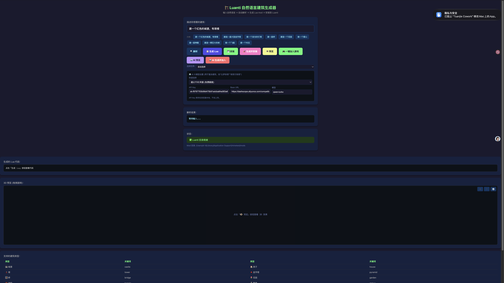
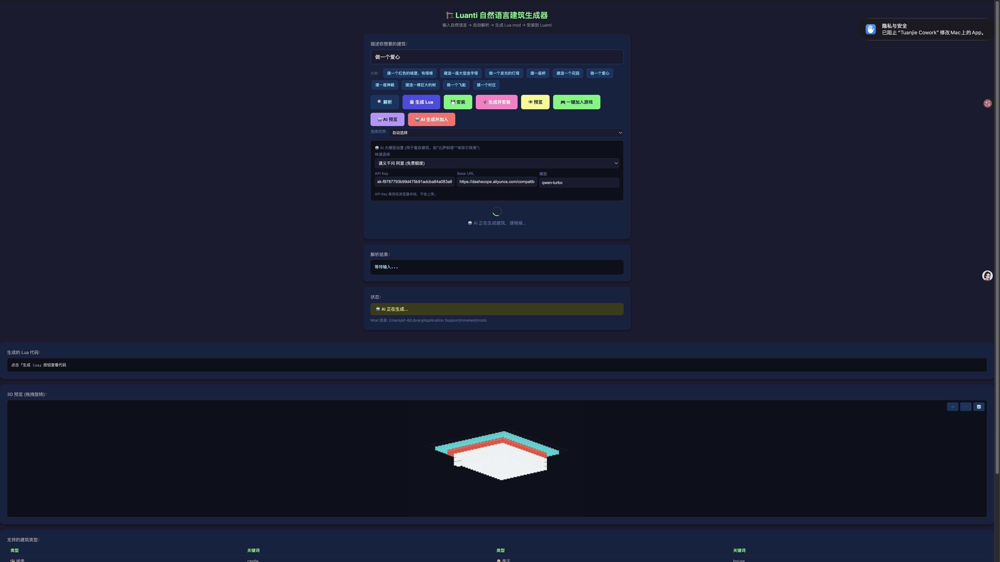

# 参赛项目：Luanti Builder — 自然语言 AI 生成 3D 沙盒建筑

## 团队 / 作者
- **GitHub**: cpufreestyle (MichaelQiu)
- 个人开发者

## 我做了什么
使用 **Codely CLI（百炼 CLI）+ TJGenerators 扩展**，从零搭建了一套「自然语言 → 3D 沙盒游戏建筑」的完整生产链路：

1. **部署开源 3D 沙盒游戏 Luanti（Minetest）** 到本机
2. **开发跨平台 GUI 工具 `luanti_builder_web.py`**（纯 Python 标准库，零依赖）
   - 输入中文/英文描述 → 自动解析 → 生成 Lua 建筑代码 → 一键安装进游戏
   - **3D 等距实时预览**（WebGPU Canvas，拖拽旋转 + 缩放）
   - **AI 大模型双模式**：① 19 种模板建筑（离线秒出）② 接入 30+ 大模型生成任意复杂建筑（城堡/金字塔/埃菲尔铁塔/宫殿…）
3. **开发完整游戏 Mod `my_first_mod` + `nl_builder`**
   - 饥饿系统、自定义生物、乐高方块、乐高上海城市
   - AI 建筑支持 20 种形状命令（box/cyl/cone/sphere/dome/ring/arch/taper…）
4. **制作 173 张贴图的乐高纹理包**
5. **解决多个工程难题**（见踩坑记录）

## 使用的工具
- **OpenWork / 百炼 CLI**: Codely CLI（Agent 编程工具）
- **百炼能力 / 模型**: Tongyi Qwen（DashScope）/ DeepSeek / 智谱 GLM 等 30+ 大模型 API
- **Skill 名称**: TJGenerators、Unity/Minetest 生成类 Skill、调研类 Skill
- **其他工具**: Python、Lua、Canvas WebGPU、Git

## 效果展示

### Web 生成器界面（左：关键词模版 / 右：3D 预览）

### 游戏内生成效果（AI 生成的建筑 + 无敌探索模式）

| 功能 | 效果 |
|------|------|
| 🏗️ 自然语言建建筑 | 输入"建一个红色城堡" → 自动生成 Lua → 游戏内 `/build` 生成 |
| 🤖 AI 复杂建筑 | 输入"埃菲尔铁塔/比萨斜塔/宫殿" → 大模型生成 1400+ 方块 |
| 🎨 3D 实时预览 | WebGPU 等距预览，拖拽旋转缩放，先看效果再进游戏 |
| 🌈 乐高风格 | 173 张贴图乐高纹理包，12 色积木方块 |
| 🏙️ 乐高上海 | `/shanghai` 一键生成东方明珠/金茂/外滩 |
| 🦸 无敌模式 | 飞行+穿墙+满血，自由探索 |

> 📹 **Demo 视频**: 由于录制工具限制，请运行 `python3 luanti_builder_web.py` 后访问 `http://localhost:8765` 现场演示，或参考下方项目链接中的仓库。

## 项目链接（可选）
- **GitHub 仓库**: https://github.com/cpufreestyle/luanti-builder
- 本地运行：`python3 luanti_builder_web.py` → 浏览器 `http://localhost:8765`

## 踩坑记录（可选）
1. **Luanti 数据路径坑**：改名 "Luanti" 后仍用旧路径 `~/Library/Application Support/minetest/`（非 `luanti/`），gameid 是 `minetest` 而非 `minetest_game` —— 导致找不到游戏/世界。
2. **Lua API 兼容坑**：`player:set_fog()` 在 5.16 已移除；`set_hp()` 不支持 `type="starve"`，否则疯狂刷 `Bad type given!`。
3. **实体残留在存档**：删除实体类型后，旧世界仍引用会导致崩溃 —— 需注册一个 `on_activate=self.object:remove()` 的占位实体自动清理。
4. **像素字上下颠倒**：Lua 的 Y 轴向上，像素图要用 `(lh-row)` 而非 `(row-1)`。
5. **建筑罩住玩家**：`/build` 若在玩家坐标生成会把人埋进墙里 —— 改为用 `get_look_dir()` 生成在玩家前方 15 格。
6. **macOS Caps Lock bug**：Luanti 聊天框默认大写，导致 `/BUILD` 无法执行 —— 在 mod 中 `register_on_chatcommand` 做大小写不敏感转发。
7. **服务进程被杀**：后台常驻的 Web 服务会被系统回收 —— 用 `nohup` 或 `run_in_background` 保持常驻。